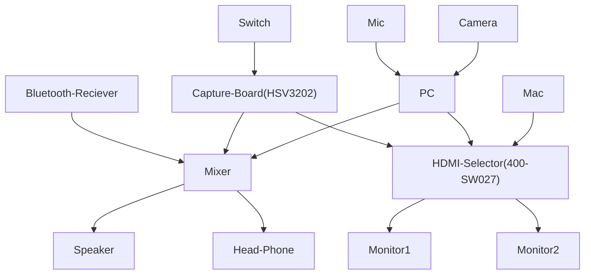

```mermaid
graph TD;
    CB["Capture-Board(HSV3202)"]
    HS["HDMI-Selector(400-SW027)"]
    BR[Bluetooth-Reciever]
    BR-->Mixer
    Switch-->CB
    CB-->Mixer
    CB-->HS
    Mic-->PC
    Camera-->PC
    PC-->Mixer
    PC-->HS
    Mac-->HS
    Mixer-->Speaker
    Mixer-->Head-Phone
    HS-->Monitor1
    HS-->Monitor2
```
